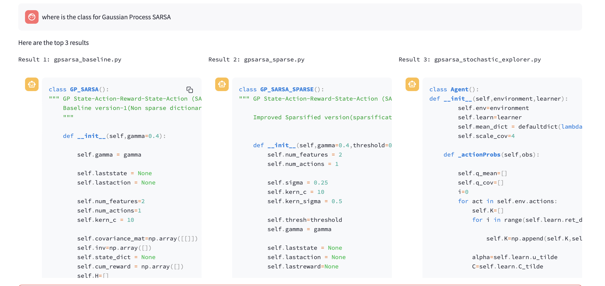

# Code-RAG

An RAG app to interact with your codebase in natural language queries in real-time. A system diagram of the project is shown below:

[//]: # (![Code-RAG Diagram]&#40;images/code-rag.drawio.svg&#41;[width=20%])


### Example Output


## Installation

To install the project, please follow the steps below:

First, Ensure you have **Python 3.10** or higher installed in your system. 
```bash
python3 -m venv venv
source venv/bin/activate
pip install .
```

## Running the RAG app UI

To run the application, please run the following commands:

```bash
cd src/
streamlit run app.py
```

This will start the streamlit server and open the application in your default browser on localhost.

## Directory Structure

The project has the following directory structure:

```
.
├── src/
│   ├── app.py
│   └── retriever.py
│   └── utils.py
├── data/
├── venv/
└── README.md
```

- `src/`
  - `app.py`: This is the main streamlit application file.
  - `retriever.py`: This file contains the core logic for the retriever. 
  - `utils.py`: This file contains utility functions for pre and post-processing of the output.
- `data/`: Created at run-time this contains the cache storage for Github repositories and the persistent local vector store. 
- `README.md`


## Supported Languages
The following languages are supported by the RAG app: 

- PYTHON (`python`)
- CPP (`cpp`)
- GO (`go`)
- JAVA (`java`)
- KOTLIN (`kotlin`)
- JS (`js`)
- TS (`ts`)
- PHP (`php`)
- PROTO (`proto`)
- RST (`rst`)
- RUBY (`ruby`)
- RUST (`rust`)
- SCALA (`scala`)
- SWIFT (`swift`)
- MARKDOWN (`markdown`)
- LATEX (`latex`)
- HTML (`html`)
- SOL (`sol`)
- CSHARP (`csharp`)
- COBOL (`cobol`)
- C (`c`)
- LUA (`lua`)
- PERL (`perl`)
- HASKELL (`haskell`)
- ELIXIR (`elixir`)


